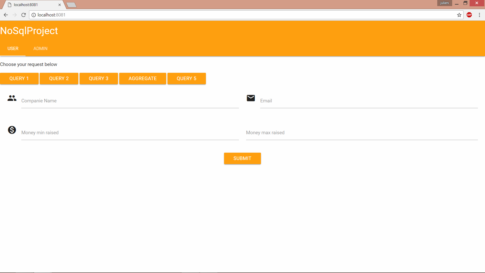
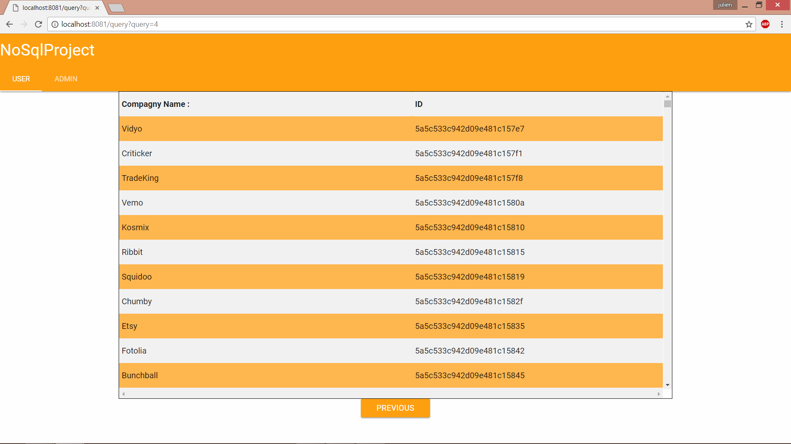

# VersionJsMongo

#How to install the app :

You have to clone the repo first by using this command :
```
git clone https://github.com/NoSQL-project/VersionJsMongo.git
```
You can also download it.
You have to launch your mongodb in background
You must install npm and NodeJs on your computer too.

#How to use the app

go into the folder you have clone or download the repo
```
cd path/to/the/app/folder
```
in the app folder, launch this command to install all the module you need :

```
npm install .
```

Next you just have to launch this command :

```
node cassandraNode.js
```

go into your browser and go to localhost:8081 !

#Home page :

Here is the home page of the app.



#Result of an aggregate query :


