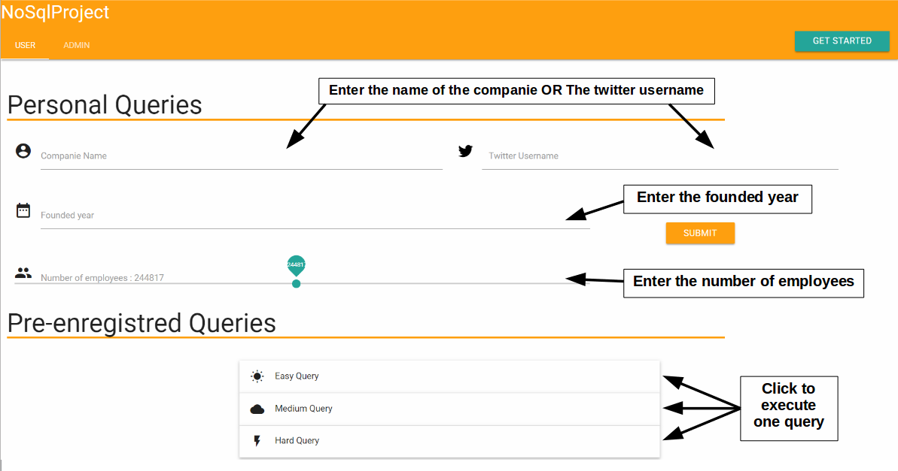
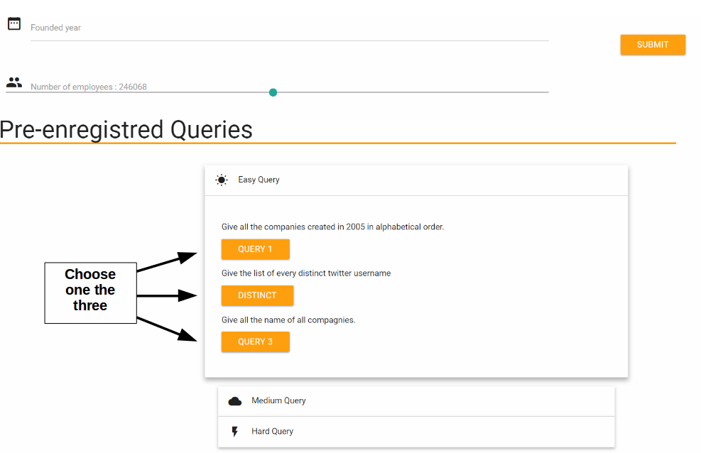
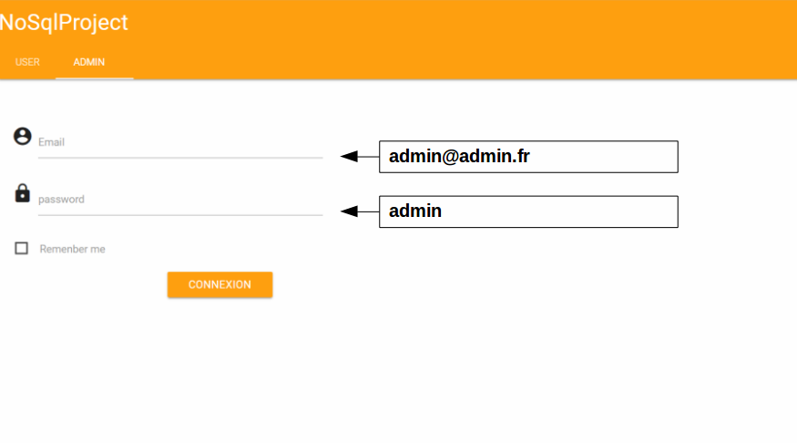
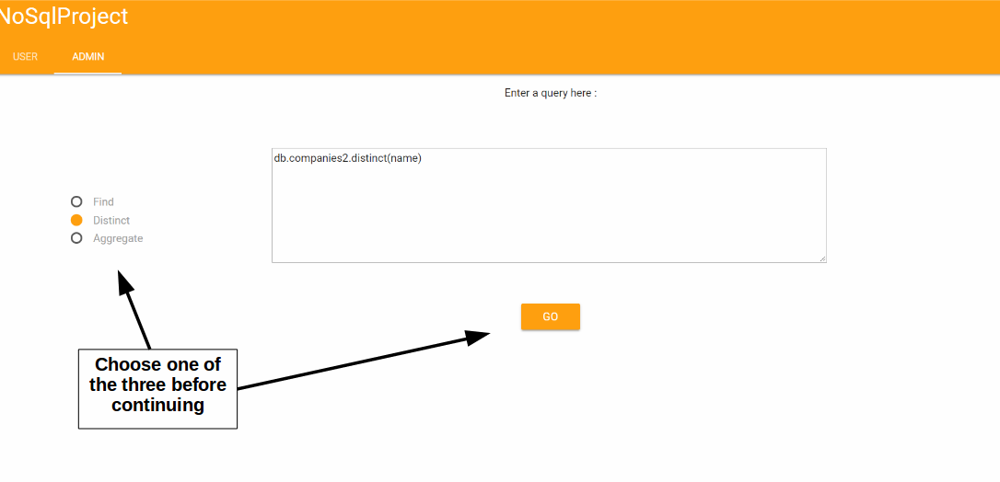
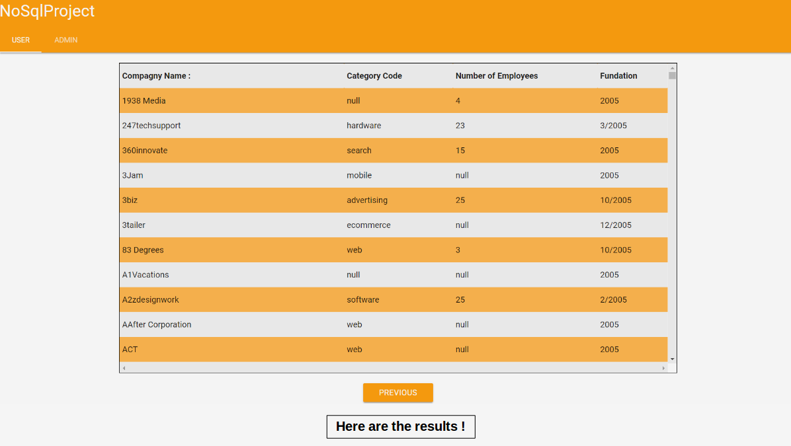

# VersionJsMongo

## How to install the app :

You have to clone the repo first by using this command :
```
git clone https://github.com/NoSQL-project/VersionJsMongo.git
```
You can also download it.
You have to launch your mongodb in background
You must install npm and NodeJs on your computer too.

you must have the __same name__ for the database : __Compagnies__
and also the __same name for the collection__ in the database : __companies2__

## How to use the app

go into the folder you have clone or download the repo
```
cd path/to/the/app/folder
```
in the app folder, launch this command to install all the module you need :

```
npm install .
```

Next you just have to launch this command :

```
node mongoDBNode.js
```

go into your browser and go to localhost:8081 !

## Home page :

Here is some Screenshot of the get started in the app..







## Result of a query :


